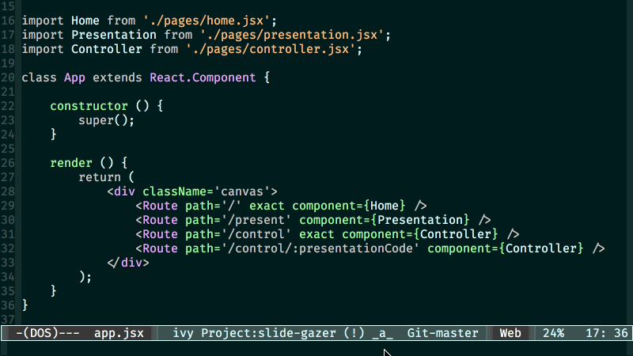

# emacs-visual-notifications

  

A utility to create visual notifications in emacs

## Installation

### Manual

Save the file *emacs-visual-notifications.el* to disk and add the directory containing it to `load-path` using a command in your *.emacs* file like:

    (add-to-list 'load-path "~/.emacs.d/")

The above line assumes that you've placed the file into the Emacs directory '.emacs.d'.

Start the package with:

    (require 'emacs-visual-notifications)

### Marmalade

If you have Marmalade added as a repository to your Emacs, you can just install *emacs-visual-notifications* with

    M-x package-install emacs-visual-notifications RET

## Usage

The following notifications are supported currently

1. Flash once

    (emacs-visual-notifications-notify-short)

The above function flashes the screen only once

2. Flash thrice

    (emacs-visual-notifications-notify-long)

The above function flashes the screen thrice

3. Flash a certain number of time

    (emacs-visual-notifications-notify-times 5)

The above function flashes the screen 5 times as specified

4. Flash until dismissed

    (emacs-visual-notifications-notify-continuous)

The above function flashes the screen until the user dismisses the notification.
